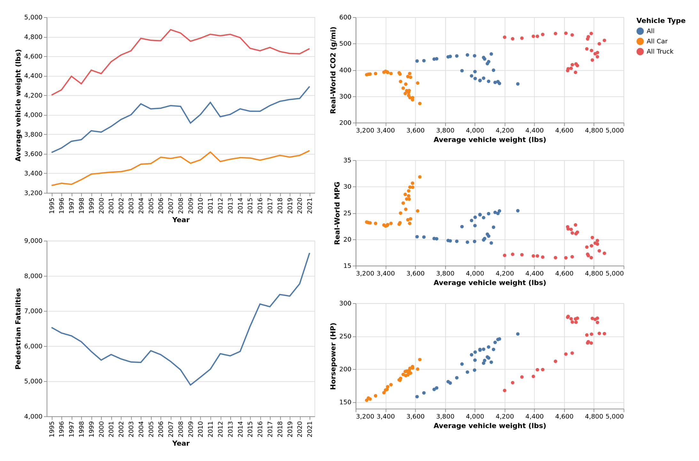

# CS 725 Semester Project Report  
Caleb Bradford  
April 26, 2024  

## Introduction  
For my topic, I decided to continue looking into the EPA automotive trends dataset I worked with last semester. My previous work concluded with a chart that showed that passenger vehicle production has shifted from mainly car type vehicles to mainly truck type vehicles, especially larger SUVs. This showed that vehicle manufacturers are opting to produce and sell larger vehicles types in recent model years.  
In this project, I wanted to take a closer look at how specific vehicle metrics have changed in relation to the weight of those vehicles. Last semester, I did see that overall vehicle weight has been increasing, and I thought that it would be interesting to see how this trend has affected other metrics like MPG and CO2 emissions.  
I also thought it would be interesting to take a look at pedestrian deaths in relation to vehicle weight, as pedestrian deaths have been on the rise in recent years, and I wanted to see how closely correlated that was with vehicle weight.  
## Data  
### EPA Automotive Trends Data 
This was the dataset I used last semester for my project, linked [here](https://www.epa.gov/automotive-trends/explore-automotive-trends-data). It contains data about model year fleets as far back as 1975, divided by vehicle types. The data I wanted to focus on for this project were the Real-World MPG, Real-World CO2 emissions, and Horesepower metrics. I specifically wanted to compare all of these metrics to the vehicle weight metric also included in the dataset.  
### NHTSA Pedestrian Fatality Data  
This dataset is from the National Highway Traffic Safety Administration, linked [here](https://www-fars.nhtsa.dot.gov/People/PeoplePedestrians.aspx). This data contains a variety of data about vehicle related fatalities. I specfically used their data about pedestrian fatalities so that I could compare those metrics against the vehicle weight data from the EPA.  
## Visualization  
### Image of static dashboard
  
### Basic Description of Charts
For my dashboard, I put two lines charts on the left side. One depicts average vehicle weight for each model year for three catagories, that being all truck type vehicles, all car type vehicles, and all vehicles in general. The other line chart depicts pedestrian fatalities from all vehicles over the years.  
The right side of the dashboard features three scatter plots, all with average vehicle weight on the x axis. They also all feature data from the three categories from the first line chart. Each mark in the scatter plot represents one model year. The y axes for the scatter plots are Real-World CO2, Real-World MPG, and Horesepower. The marks also include tooltips that allow the user to see what year the mark corresponds to, as well as the exact value of the attribute featured in that scatter plot. 
As far as interactive elements go, both of the line charts are brushable on the x axis, which applies a filter to all three of the scatter plots, which lowers the opacity of any points not selected. The scatter plots themselves also have interactivity, as clicking on an individual point in one scatter plot will select the point for that model year in the other scatter plots.  Lastly, the legend is selectable, which allows for filtering of specific vehicle types.  
## Design Decisions  
### Visual Encodings  
#### Line charts  
Both of the line charts have year on the x axis, with one having vehicle weight on the y axis, and the other having pedestrian fatalities on the y axis. This is appropriate because the year is a time series attribute, and both of the y axes have a quantitative attribute. The different vehicle type categories are encoded with color.  
#### Scatter plots  
All of the scatter plots feature average vehicle weight, a quantitative attribute, on the x axis. They also all feature a different quantitative attribute on the y axis for each scatter plot. As in the line charts, color is used to encode the different vehicle types.  
### Interactive Elements  
The interactivity from the brushable line chart allows the user to brush over the line chart and see the highlighted years emphasized on the scatter plot, allowing the user to use the scatter plots to track how the marks move over time. It also allows the user to compare the values present in the line charts with the marks in the scatter plot.  
The interactivity in the scatter plots allows the user to pick specific years in order to see the same model year mark on each scatter plot, making it easy for the user to easily see each value for that model year.  
Lastly, the interactivity from the legend allows the user to highlight and focus on specific categories, making it easier to hone in on trends among the vehicle types.  
## Development Process  
I spent roughly 15 hours on the development of my visualization between getting the data, building the charts, and tying them together with interactivity. I would definitely say the most time consuming element of the process was getting the pedestrian fatality data, since the site that hosted the data made it pretty difficult to get the data that I wanted.  
## References  
- UW interaction examples for legend and brush selection (https://observablehq.com/@uwdata/interaction)
- Interaction example from class (https://observablehq.com/@oducs-vis/vega-lite-dashboard-with-brushing-and-linking?collection=@oducs-vis/cs-725)